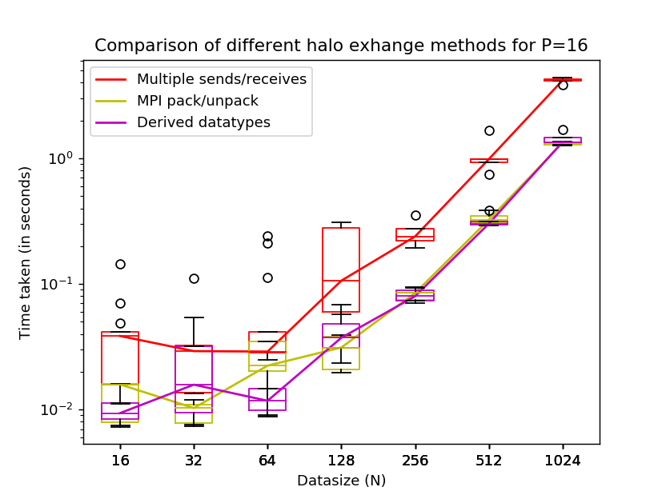
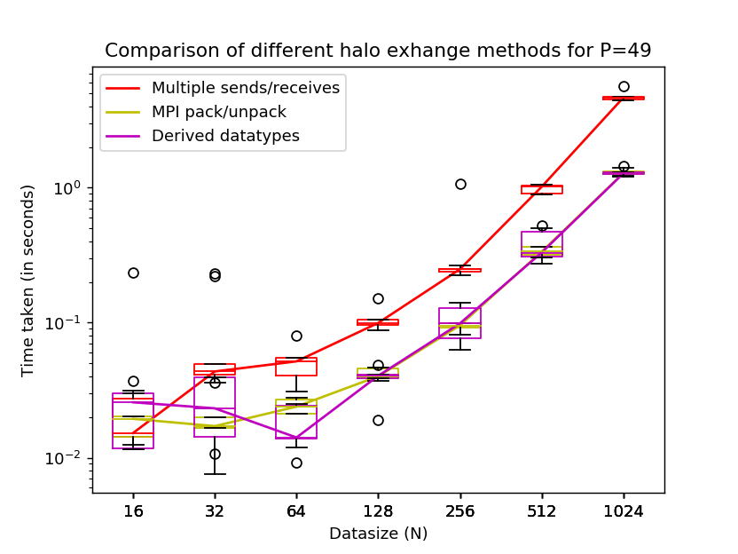

# Assignment 1

All questions/subquestions have been attempted. In case of any discrepancies please contact either of the group members.<br>
We have tried our best to adhere to all the naming conventions as described in the problem statement.

## A quick walk through the files

Following is a list of the files and possible options in them :

* **src.c(halo)** <br>
	Main communication/computation script: It branches out from main() using the option argument from the command line.<br>
	The general structure of each branched out function is:
	-	Random initialization of a matrix per process.
	-	Communication using non-blocking calls Isend/Irecv and branch specific methods.
	-	Computation on inner elements of each matrix (which do not need any elements from neighboring processes).
	-	Waitall while all communication (send/receives) finish.
	-	Case specific computation of halo elements using received elements from neighboring processes.
	-	Back to communication step when in a time step loop.
	-   We report the total time spent in communication and computation for all the time steps

```sh
	mpirun -np P ./halo N O   #P is the number of processes, N is the number of sides in data matrix
				# & O is an option{1,2,3} which branches for various communication schemes covered.
```

* **Makefile**

```sh
	make        # Builds the executable for src.c named halo
	make clean  # Removes the executables binaries created in the make process. 
```

*	**hostfile.sh**<br>
	The Generate Hostfile script: Pings systems on the cluster(`csews20-34`) to get a list of active hosts available

```sh
	bash hostfile.sh
```

*	**plot.py**<br>
	The Plotting script: Uses `data*.txt` files to generate Box Plots

```sh
	python3 plot.py
```

*	**run.sh**<br>
	The Job script: Triggers various components of the assignment(`Makefile`, `hostfile.sh`, `src.c`, `plot.py`). <br>

```sh
	bash run.sh
```

*	**data\*.txt**<br>
	There are four data files(\*=16,36,49,64) generated by `run.sh` as the data dump corresponding to the number of processes.

*	**plot\*.png**<br>
	There are four box plots (\*=16,36,49,64) generated by `run.sh` corresponding to each datafile and with various configurations.	

## Running the code


```sh
	cd Assignment1
	bash run.sh
```

Files created in this process include `halo`(executable for src.c), `hostfile`, `data*.txt` & `plot*.png` .


## Observations

-	For all values of P (number of processors), the multiple send/recv method performed poorly as compared to the other two. The performance can be attributed to the large number of Isend/Irecv calls (one each for each halo element) needed for communication of halo elements.

-	The performance of the MPI Pack/Unpack and Derived datatypes methods is better in terms of total time taken as compared to the multiple sends/receive method. The performance of both these methods is comparable to each other and the time of both the methods almost coincides as we move beyond N=128. For lower values of N, we observe some differences between the timings of these methods. This initial disparity could be because of the data being small and the network lag playing a larger role in the time of communication.

-   For all the methods, and all values of P, we observe that the variation between the 5 executions of the same configuration is higher for lower values of N. As we move beyond N=128, this variation between the 5 executions is very small. This may also be because the variations introduced by network lag are more visible when the amount of data is less and hence, the time of communication/computation is smaller.


### Box Plots





