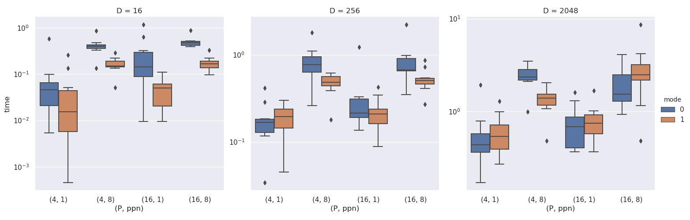
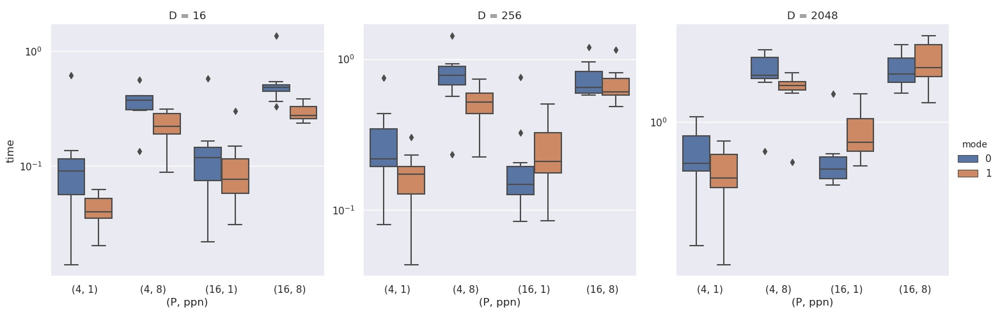
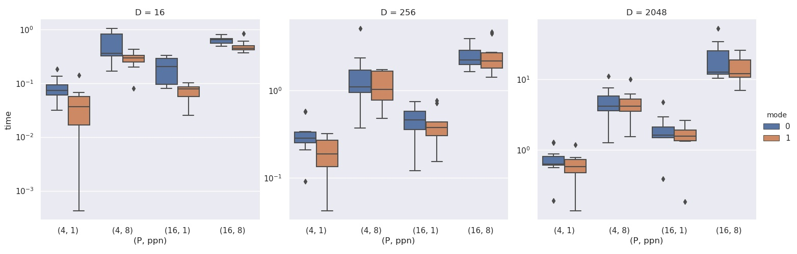
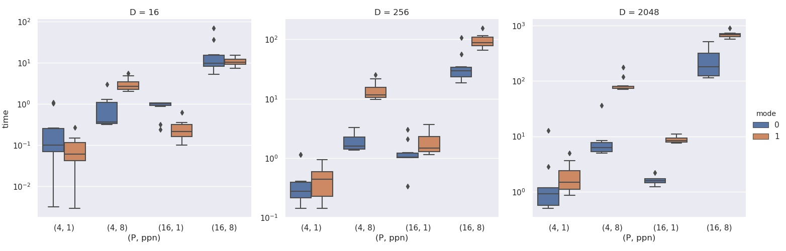

# Assignment 2

All questions/subquestions have been attempted. In case of any discrepancies please contact either of the group members.<br>
We have tried our best to adhere to all the naming conventions as described in the problem statement.

## A quick walk through the files

Following is a list of the files and possible options in them :

* **src.c(code)** <br>
	Main communication script: It branches out from main() using the option and optimization argument from the command line.<br>
	There are two types of functions corresponding to each collective:
	- default: This function executes the default MPI collective.
	- optimized: This function executes the modified implemenation of the MPI collective which we propose to obtain performance improvements. The optimizations and changes made are explained [below](#Optimizations).

```sh
	mpirun -np P -f hostfile ./code D option optimized   
            #P is the number of processes, D is the data size for communication.
			#option is a value{1,2,3,4} which branches for various collectives covered.
            #optimized is a value {0,1} which selects whether to run the default collective or the optimized version.
```

* **Makefile**

```sh
	make        # Builds the executable for src.c named code
	make clean  # Removes the executables binaries created in the make process. 
```

*	**script.py**<br>
	The helper script provided to generate the hostfile

*	**plot.py**<br>
	The helper plotting script provided: Uses `data*.txt` files to generate the required plots

*	**run.sh**<br>
	The Job script: Triggers various components of the assignment(`Makefile`, `hostfile.sh`, `src.c`, `plot.py`). <br>

```sh
	bash run.sh
```

*	**data_\*.csv**<br>
	There are four data files(\*=1,2,3,4) generated by `run.sh` as the data dump corresponding to the different collectives (MPI_Bcast, MPI_Reduce, MPI_Gather, MPI_Alltoallv).

*	**plot_\*.jpg**<br>
	There are four Category plots (\*=1(BCast),2(Reduce),3(Gather),4(AlltoAllv)) generated by `run.sh` corresponding to each datafile and with various configurations.	

## Running the code


```sh
	cd Assignment2
	bash run.sh
```

Files created in this process include `code`(executable for src.c), `hostfile`, `data_*.csv` & `plot_*.jpg` .


## Optimizations
Our optimizations work by reducing the number of inter-switch or inter-group calls made by processes. Reducing inter-switch communication improves performance since the distance is reduced. Further there is usually lower congestion on lower-level switches, since the higher level switches will be used by mutiple applications running on the cluster/network.

For achieving this, in the optimized code for each collective, we create two times of communicators. The **intra_group** communicator includes the processes of the same group. The **inter_group** communicator includes the first process of each group (rank 0 of each intra_group communicator). Using this we describe the collective calls made to achieve the same functionality as the default MPI collective call.

* **MPI_Bcast** <br>
MPI_Bcast is first called by the first process of each group using the inter_group communicator. This is followed by a MPI_Bcast call by all processes using the intra_group communicator.

* **MPI_Reduce** <br>
MPI_Reduce is first called by all processes using the intra_group communicator. This is followed by a MPI_Reduce call by the process of each group using the inter_group communicator.

* **MPI_Gather** <br>
MPI_Gather is first called by all processes using the intra_group communicator. This is followed by a MPI_Gather call by the process of each group using the inter_group communicator.

* **MPI_Alltoallv** <br>
In this, we create additional inter_group communicators for other ranks of each group. This means there is an inter_group containing rank 0 of each group, rank 1 of each group and so on. We accumulate the data at each rank from all other ranks using MPI_Gatherv calls. For getting the data at any rank (intra_rank corresponding to intra_group communicator = r), there is a MPI_Gatherv call using intra_comm, with the root node as r. This is followed by an MPI_Gatherv call by all processes with intra_rank r using the corresponding inter_group communicator to send the data to the desired rank.

## Observations

* **MPI_Bcast** <br>
For all configurations, we observe better or similar performance using our optimized MPI_Bcast as opposed to the default call.

* **MPI_Reduce** <br>
For most configurations, we observe better or similar performance using our optimized MPI_Bcast as opposed to the default call. For some configurations (like D=256, P=16, ppn=1), we observe slightly higher average time as compared to default, but there is also high variation in the timings for these configurations. Hence, the performance degradation may also have been due to external issues such as high network traffic at that time.

* **MPI_Gather** <br>
For all configurations, we observe better or similar performance using our optimized MPI_Gather as opposed to the default call.

* **MPI_Alltoallv** <br>
For most configurations, we do not achieve any improvement and the performance of the modified Alltoallv is worse than the default call. This shows that the library algorithm for MPI_AlltoAllv performs better than mutiple MPI_Gatherv calls for each rank. 

Overall, we observe that for MPI_BCast, MPI_Reduce, and MPI_Gather, the modified implementations perform better than the default. This shows that reducing the number of inter-switch MPI calls made by processes can improve performance since inter-switch communication is more costly due to higher distance between nodes and more network congestion. For MPI_AlltoAllv, the modified implementation performs worse than the default. This maybe due to increase number of MPI calls from each rank which outweigh the improvement from combining the calls made by processes on the same node.

## Issues faced
The number of configurations and executions for each requires a long time to run. Network uncertainities, such as nodes becoming unreachable during the script execution, can cause the script to get stuck. Hence, to collect the complete data, we needed to run the main script (run.sh) multiple times.

### Box Plots
* **MPI_Bcast** <br>


* **MPI_Reduce** <br>


* **MPI_Gather** <br>


* **MPI_Alltoallv** <br>

