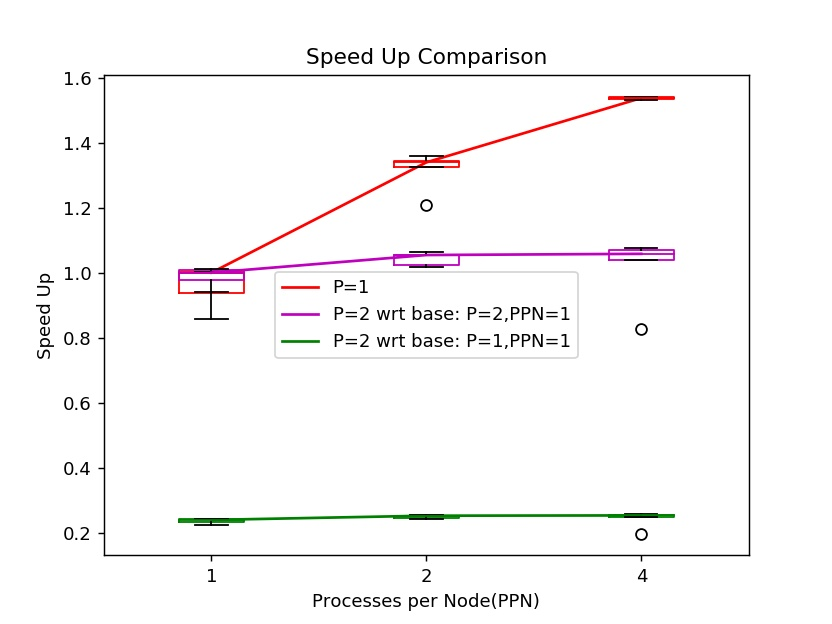

# Assignment 3

All questions/subquestions have been attempted. In case of any discrepancies please contact either of the group members.<br>
We have tried our best to adhere to all the naming conventions as described in the problem statement.

## A quick walk through the files

Following is a list of the files and possible options in them :

* **src.c(code)** <br>
	Main communication script:<br>
	The code can be understood to be divided into four major components:
	- Read Data: We first read the data from the given file from the process ranked 0.
	- Broadcast Metadata: The number of rows and columns are broadcasted to each process.
	- Distribute Data(Scatterv): This relevant parts of this read data are then communicated to all the processes.
	- Calculate Yearwise Minimum: Each process then calculates the yearwise minimum for the row that was communicated to it.
	- Reduce/Gather Data: The minima calculated are now communicated back to the root process(We use a Reduce call for it).
	- Compute Global Minimum: We compute the global minimum from the yearwise minima gathered from all processes
	- Print Data: The data for yearwise minima, global minimum and execution time is then dumped. 

```sh
	mpirun -np P -ppn PPN -f hostfile ./code tdata.csv   
            #P is the number of processes, PPN is the processes per node.
```

* **Makefile**

```sh
	make        # Builds the executable for src.c named code
	make clean  # Removes the executables binaries created in the make process. 
```

*	**script.py**<br>
	The helper script provided to generate the hostfile.

*	**plot_1/2.py**<br>
	The helper plotting script provided: Uses `data.csv` file to generate the required plots.

*	**run.sh**<br>
	The Job script: Triggers various components of the assignment(`Makefile`, `script.py`, `src.c`, `plot.py`). <br>

```sh
	bash run.sh
```

*	**output.txt**<br>
	Holds the data in the required format for the latest execution.(Overwritten by each configuration)

*	**data.csv**<br>
	A data file generated by `run.sh` as the time data dump corresponding to the configurations used for plotting purposes.

*	**plot.jpg**<br>
	A Box plot generated by `run.sh` representing data points corresponding to each various configurations.	

## Running the code


```sh
	cd Assignment3
	bash run.sh
```

Files created in this process include `code`(executable for src.c), `hostfile`, `output.txt`, `data.csv` & `plot.jpg` .

## Data Distribution Strategy

We distribute the data from the given file in a row major manner. Each row(corresponding to a location or station) is scheduled to be sent to a specific process in the current running configuration. The root process first broadcasts the number of rows and columns to each process. The vectors for the rows to be sent to a process are created at the root process and then are sent ahead using MPI_Scatterv.

The computed Local minima at each process level are then communicated back to the root process by a MPI_Reduce which reduces a vector of the yearwise data to get the yearwise minimum at rank=0.  

Earlier we considered distributing data in a column major manner. However, later realized that this sort of a technique could end up distributing the data unequally leaving a lot of computation in the nodes towards the end of the round-robin, when the number of columns were not an integral multiple of the number of processes being used. In row major manner as well, a few processes may get an additional row but the number of rows (430469 in the current file) is much higher than the number of columns (41). The maximum difference in the number of data points on each process is atmost equal to the number of columns in row major distribution whereas it is equal to the number of rows in column major distribution. Hence, the load imbalance will be more severe in column major distribution. Even when the files are changed we will expect the number of stations (rows) to be much higher than the number of years (columns).
Thus, we then changed to the approach earlier mentioned (row major) as it ensured that the computational work was always fairly distributed, putting no undue pressure on a few nodes.

## Observations
In the below discussion as well the generated plots we use P to denote the number of nodes, and PPN to denote the processes per node. Hence, P*PPN gives us the total number of processes.

1. We observe that the time taken for exceution when the processes are present on the same node (P=1) is lower than when the same number of processes are distributed over two nodes (P=2). For example, when the total number of processes is 2, the time taken for the configuration P=2, PPN=1 is almost 6x the time taken for the configuration P=1, PPN=2. This is because the inter-node communication cost is significantly higher than intra-node communication cost due to larger distance (more number of hops) as well as contention on the network switches. The same trend is observed when the number of processes is 4, and the time taken for the configuration P=2, PPN=2 is around 7x the time taken for the configuration P=1, PPN=4.

2. We observe scaling up with increase in number of processes when P=1, that is all the processes are present on the same node. We observe a speedup of 1.3x and 1.6x for P=1, PPN=2 (processes=2) and P=1, PPN=4(processes=4), respectively on comparing with P=1, PPN=1 (processes=1) (red line in plot_2 showing speedup). This shows the advantage of distributing the data and parallelizing the computations. The time taken for all values of PPN when P=2 is higher than for a single process, and we do not observe any scaling when compared with P=1, PPN=1 (green line in plot_2 showing speedup). This maybe because the inter-node communication cost overshadows any time reduction obtained from parallelizing the computation for the current file size. We may observe a speedup as the computation size increases. <br> 
We observe a small decrease in time taken when the PPN value is increased from 1 to 4, keeping P=2 (pink line in plot_2 showing speedup). This may be because communication overhead for these configurations is similar for all since P=2, and the computation time reduces due to parallelization.


### Box Plots
* **Time Consumed vs PPN** <br>

* **Speed Up** <br>



